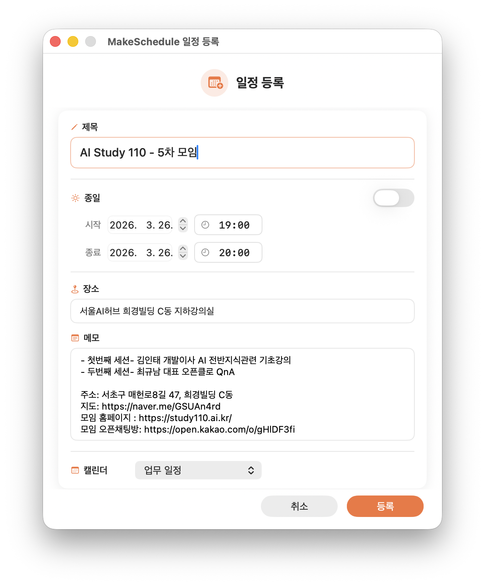

# MakeSchedule

선택한 텍스트에서 AI로 일정을 추출하여 macOS 캘린더에 등록하는 PopClip Extension입니다.

## 기능

메일, SNS, 메시지 등에서 모임/일정 공지 텍스트를 선택하면:

1. **Gemini 2.0 Flash**가 텍스트에서 일정 정보를 JSON으로 구조화 추출
2. **SwiftUI 네이티브 대화상자**에서 추출된 일정을 검수/편집
3. **Calendar.app**에 EventKit으로 정확하게 등록

## 사용 흐름

### 1. 일정 텍스트 선택

SNS, 메일, 메시지 등에서 일정이 포함된 텍스트를 드래그하여 선택합니다.


### 2. PopClip 메뉴에서 MakeSchedule 클릭

PopClip 메뉴에서 오렌지색 캘린더 아이콘을 클릭합니다.


### 3. 일정 검수/편집

Gemini AI가 추출한 일정 정보를 확인하고 필요시 수정합니다.
제목, 날짜, 시간, 장소, 메모, 캘린더를 편집할 수 있습니다.



### 4. 캘린더 등록 완료

등록 버튼을 클릭하면 macOS 알림으로 결과를 확인할 수 있습니다.


Calendar.app에 모든 정보가 정확하게 등록됩니다.


## 주요 특징

- Gemini AI가 한국어 일정 텍스트를 정확하게 파싱
- macOS 네이티브 DatePicker로 날짜/시간 편집
- 캘린더 드롭다운으로 등록할 캘린더 선택 (마지막 선택 기억)
- 종일 일정, 여러 날 일정 지원
- 장소, 메모 (강의내용, 주소, 링크 등) 자동 정리
- 에러 시 모달 대화상자로 명확한 안내
- 일정 정보가 없는 텍스트 선택 시 안내 메시지

## 설치

### 사전 요구사항

- macOS 13+ (Ventura) — **Apple Silicon (M1/M2/M3/M4) 필수**
- [PopClip](https://www.popclip.app/) 4586+
- [Xcode Command Line Tools](https://developer.apple.com/xcode/) (SwiftUI 빌드용)
- Python 3.11+
- Gemini API Key ([Google AI Studio](https://aistudio.google.com/)에서 무료 발급)

> Intel Mac에서는 소스에서 직접 빌드하면 동작합니다.

### 설치 방법

```bash
git clone https://github.com/beret21/MakeSchedule.git
cd MakeSchedule
./install.sh
```

또는 수동으로:

1. SwiftUI 앱 빌드: `cd MakeScheduleUI && swift build -c release`
2. 바이너리 복사: `cp .build/release/MakeScheduleUI ../MakeSchedule.popclipext/`
3. `MakeSchedule.popclipext` 폴더를 더블클릭하여 PopClip에 설치
4. PopClip 설정에서 **Gemini API Key** 입력
5. 첫 실행 시 `google-genai` 패키지가 자동 설치됩니다
6. 첫 실행 시 캘린더 접근 권한을 허용해주세요 (아래 참고)

## 캘린더 접근 권한

### 첫 실행 시 권한 요청

MakeSchedule을 처음 실행하면 macOS가 PopClip의 캘린더 접근 권한을 요청합니다.
**'허용'을 클릭**하면 이후 캘린더 목록 조회 및 일정 등록이 가능합니다.


> **'전체 캘린더 접근'** 권한이 필요합니다. '추가만 허용'으로는 캘린더 목록을 불러올 수 없습니다.

### 권한을 거부한 경우

권한을 거부하거나 나중에 변경하려면, 일정 등록 화면에서 단계별 안내가 표시됩니다.


안내에 따라 다음 순서로 진행해주세요:

1. **시스템 설정 열기** 버튼을 클릭하여 시스템 설정 > 개인정보 보호 및 보안 > 캘린더로 이동
2. PopClip에 **'전체 캘린더 접근'** 권한을 허용
3. 권한 설정 후 PopClip이 자동으로 재실행됩니다
4. 이 창을 닫고, 텍스트를 다시 선택하여 MakeSchedule을 실행

## 일정 정보가 없는 텍스트

일정과 관련 없는 텍스트를 선택하여 실행하면 안내 메시지가 표시됩니다.


## 문제 해결

### 기타

- 로그 확인: `tail -f /tmp/makeschedule_$(date +%Y).log`
- 설치 초기화: `rm ~/.makeschedule_setup_done_v2`
- 캘린더 권한: 시스템 설정 > 개인정보 보호 및 보안 > 캘린더
